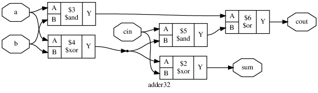
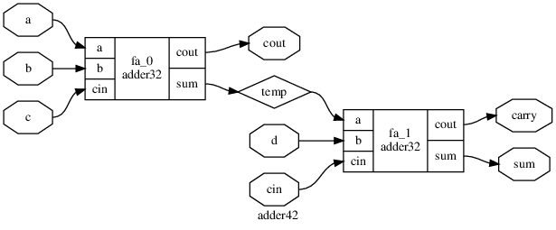
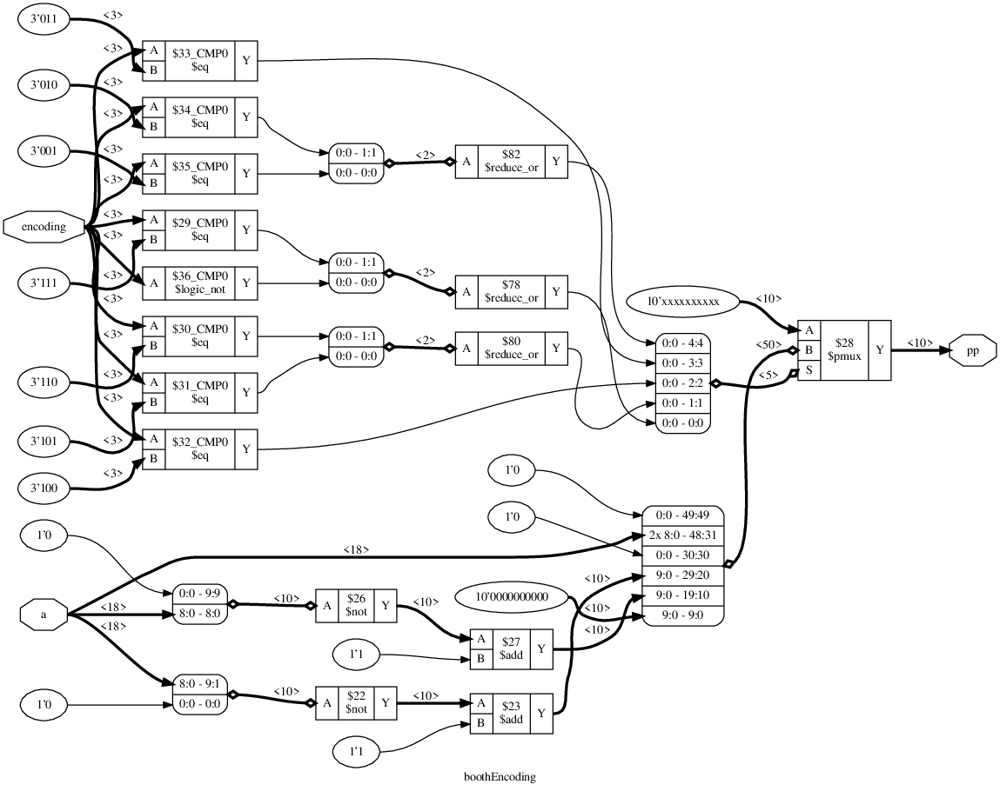
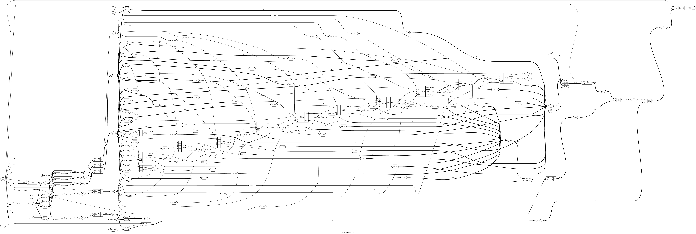
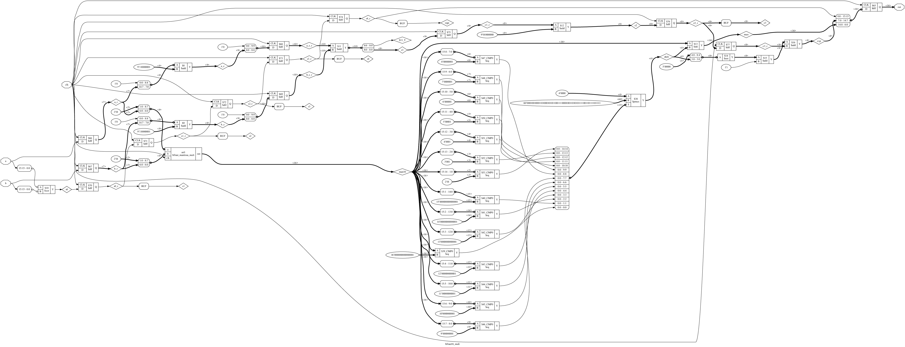

# CNN on FPGA
An Assortment of Convolutional Neural Network Layers on Verilog with reference on C


### Current Activity
* Minh Truong:
* Arthur Hlaing:
* Kawah Yee:
* Adam Jones:

### Past Activity
* Minh Truong:
  * Implemented maxpooling layer.
  * Implemented fully connected layer.
  * Implemented batchnorm layer.
  * Connected different MNIST layers together.
  * Wrote parsers for parameters load.
  * Developed customizable ````pytorch```` model package.
  * Setup accuracy testing script for MNIST C implementation.
  * Built and extracted parameters from Resnet50 architecture
  * Built HDF5 file system.
  * Built bfloat16 adder.
  * Built bfloat16 mantisa multiplier.
  * Built bfloat16 multiplier
* Arthur Hlaing:
  * Implemented convolutional layer.
  * Built and extracted parameters from the MNIST architecture.
  * Connected different MNIST layers together.
  * Organized parameters files output.
  * Developed Pytorch MNIST model
  * Debugged weights migration to C code
  * Built inLayer() of Resnet50
  * Built BasicBlock() and Bottleneck() of Resnet50
  * Built Alexnet in C.
  * Built bfloat16 adder.
  * Built booth encoder.
  * Built bfloat16 mantisa multiplier.
  * Built bfloat16 multiplier
* Kawah Yee:
* Adam Jones:

# C Code
### Run reference
To run AlexNet:

```
python resize.py {filename}
make alex_model
./model
```

To run MNIST:

```

make mnist_model
./model
```
### Setup pytorch (our customizable package, the real package name is torch)
Run the following commands to build essential packages for data extraction.
CAUTION: run these commands inside virtual environment for safety reasons. Default env is (base))
````
conda activate
python setup.py develop
````
To remove the package
````
bash cleanup
````

### Test accuracy
Run the following commands
in ````paramater_extraction/architecture_to_test/benchmark_data/````, run
````
conda activate
python create_dataset_folders.py
````
then execute ````./test.o```` in mnist folder. When done, delete all images in ````paramater_extraction/architecture_to_test/benchmark_data/````
before git.

* Test on 200 images for MNIST C implementation shows accuracy of 95.5% . Real
accuracy from Pytorch is 93% .There are memory leaks so do not run too many test cases.

# Verilog Code
### Status
Bfloat16 format is implemented on multiplier and adder. Exhaustive testbench is needed
to validate the implementation. Verilog is currently synthesize thanks to ````yosys````.
Images are at highest resolution, download them to have zoom in. ````dot```` files are
also available inside ````\image```` for interactive sessions.

### Adder


### Multiplier
##### Adder 32


This is Full-Adder circuit used in ````bfloat_mantisa_mult.v````. This circuit is
used for adding the first and second place binary bits after encoding.

##### 4-2 Compressor


This is Adder circuit used in ````bfloat_mantisa_mult.v```` for the next 10 binary bits
after encoding.

##### Booth Encoder


This is booth encoding lookup table to transform ````b```` in ````a * b = c````
into partial products. ````a```` can be rewritten in terms of these partial products
and ````adder32.v````, ````adder42.v```` are used to sum them.

##### Mantissa Integer Multiplier


The previous 3 circuits make up the Mantissa Integer Multiplier. This circuit takes
3 clock cycle to warm-up and produce 1 product per cycle through pipelining.

##### Bfloat16 Multiplier


This circuit finishes the equation by resolving sign and exponent bits. It also
truncate the product of ````bfloat_mantisa_mult.v```` to comply with bfloat16 format.

### Links
[Team Drive](https://drive.google.com/drive/u/0/folders/0ANe2ju35xsddUk9PVA)

[Timeline](https://docs.google.com/spreadsheets/d/1Jvismn1Z5gcMJbm1m1PkuQDigpMFATq9cbqUX1LdR5o/edit?usp=drive_web&ouid=102807836831655614610)

[Pytorch Documentation](https://pytorch.org/docs/stable/index.html)
